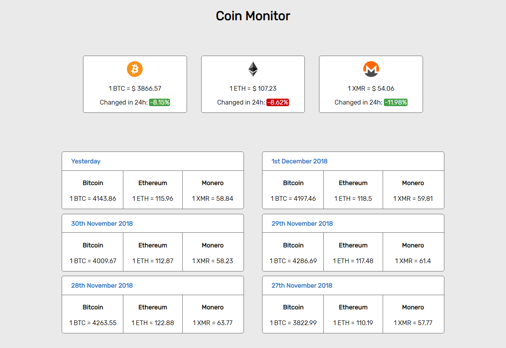

# Coin Monitor
> Webapp to watch the prices of BTC, ETH and XMR

It uses React in the frontend and gets the data(current price, history, change percentage, etc) from CryptoCompare's API


## Installing / Getting started

Clone the repo and then install the dependencies to start the client.
```shell
git clone https://github.com/ArmandoGraterol/coin-monitor
cd coin-monitor
npm install
npm start
```

## Features

* Monitors the current price of Bitcoin, Ethereum and Monero.
* Gets the change percentage of the price in the last 24 hours of the 3 coins.
* Lists the average prices of BTC, ETH and XMR in the last 6 days.

## Licensing

The code in this project is licensed under MIT license.